# Moviestagram

[TOC]

## 팀원 정보 및 업무 분담 내역

> 박예린
>
> 곽민준
>
> - 평점 기반 추천 알고리즘 구현  
>
> - json 생성, 데이터 푸시
>
> - accounts app 기본 구현
>
> - community app 기본 구현
>
> - movies app 추가 구현
>
> - kakao login API 활용 계정 연동 구현
>
> - TMDB API 활용 상영예정작 호출
>
> - 간단한 디자인
>
>   

## 목표 서비스 구현, 실제 구현 정도 및 필수 기능

### 0. 개발 도구

### 1. 영화

- 영화 목록, 페이지네이션

  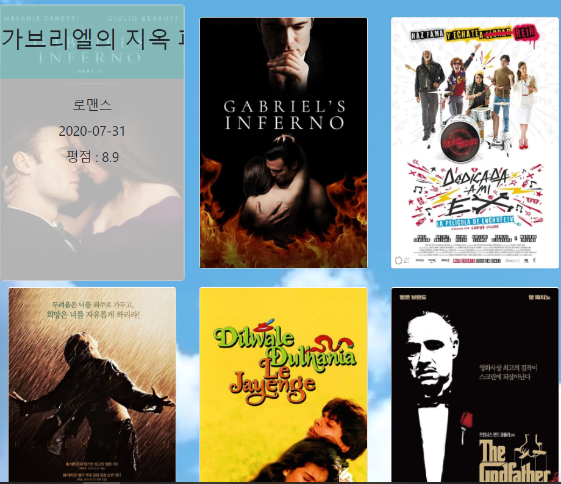

DB에 있는 영화들을 페이지네이션을 활용하여 한페이지에 9개씩 보여주도록 구현하였습니다.

마우스를 올리면 영화 제목, 장르, 평점을 볼 수 있으며, Ajax를 활용하여 좋아요 기능을 구현하였습니다.

호버링을 이용하여 떠오르는 것을 구현하였습니다.

추천영화로 들어가면 역시 9개씩 보여주긴 하지만, 본인이 평점을 높게 준 영화들에 기반하여 추천영화목록을 나타냅니다.

- 영화 detail

  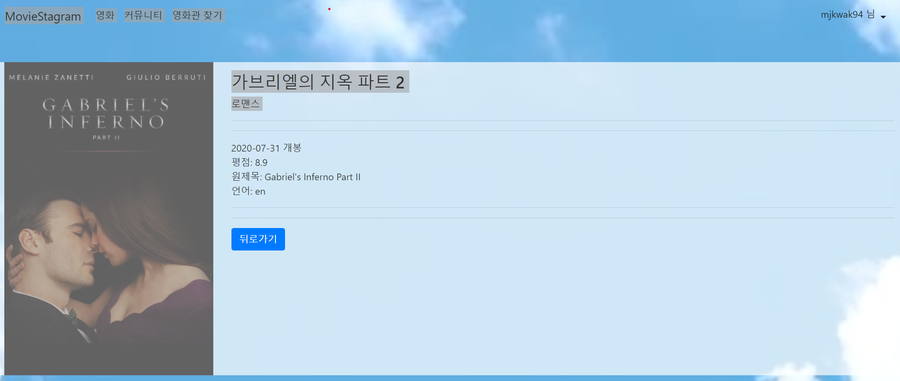

TMDb에서 크롤링한 영화 데이터중 제목, 장르, 평점, 원제목, 언어를 보여주도록 구현하였습니다. 간단하게 포스터도 나타내도록 하였고 버튼을 이용하여 뒤로 갈 수 있게끔 하였습니다.

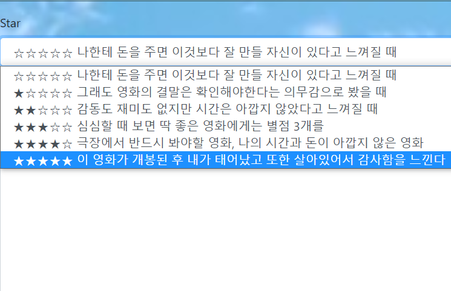

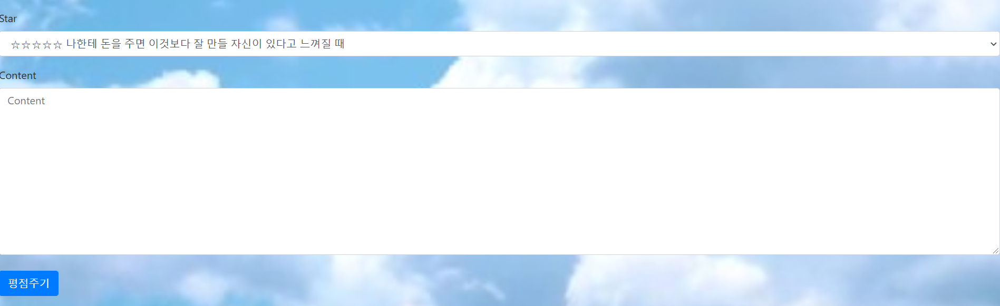

 평점을 매기면서 간단하게 제가 해당 별점을 줄 때 느끼는 기분을 적었습니다. 감상평의 갯수와 평균 평점도 나타냈습니다.

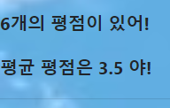

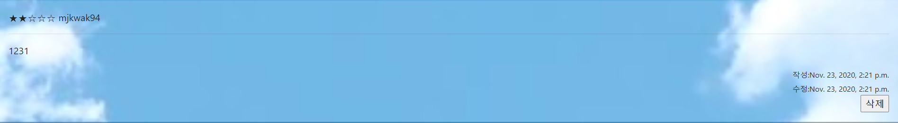

평을 남긴 후에는 이런 식으로 나타납니다. 별점 갯수와 남긴 사람, 그리고 약간의 감상평이 남고 작성일자가 남습니다. 수정은 아직 구현 안 했습니다.

- 이벤트 배너

부트스트랩의 캐로샐을 이용하여 지브리스러운 이미지를 구현하려 했습니다. 이 그림을 누르면 차례로 지브리 나무위키 페이지, 지브리 공식 홈페이지, 그리고 서울 3반 곽민준의 인스타그램이 나옵니다.

### 2. 커뮤니티

- 게시판 구분

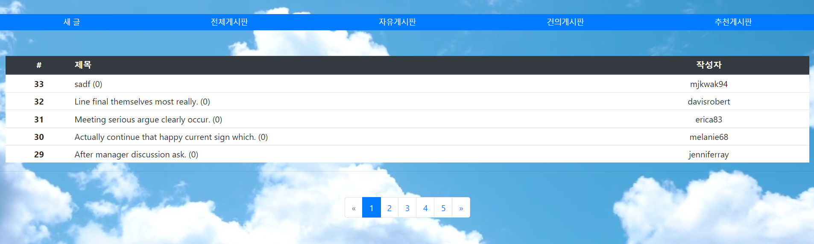

클릭 시, 각 게시판의 목적에 맞는 게시글들을 보여줍니다. Post모델 안에 purpose field를 만들어서 글의 목적에 따라 분류할 수 있습니다.

- 게시글 작성

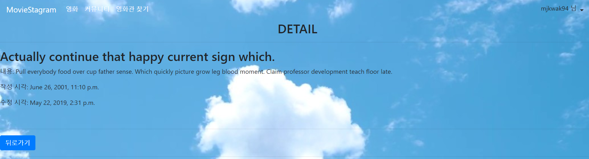

*로그인한 사용자만 게시글을 작성할 수 있으며, 게시판의 목적을 선택하여 입력할 수 있도록 하였습니다.*

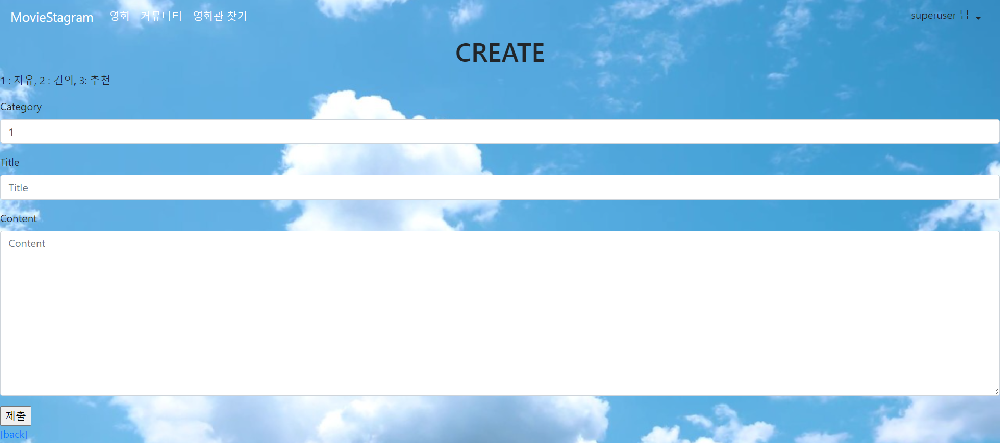

글을 쓸 때에는 카테고리와 제목, 내용을 입력하면 됩니다.

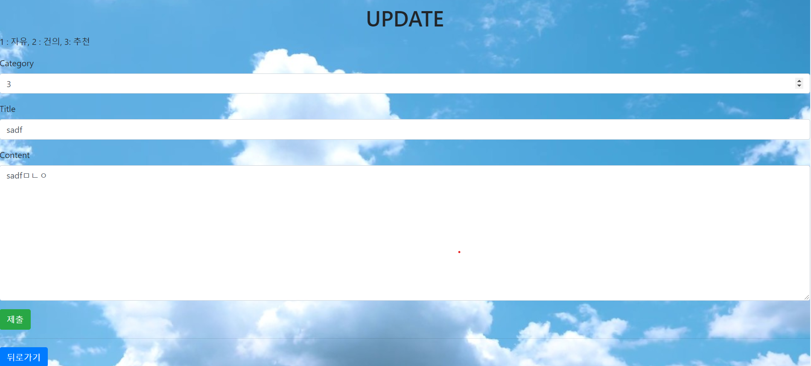

로그인된 유저의 경우 본인이 작성한 글의 detail에 들어가면 글을 수정할 수 있습니다. 수정도 이런식으로 하면 됩니다.

### 4. 영화관 찾기

- 근처 영화관

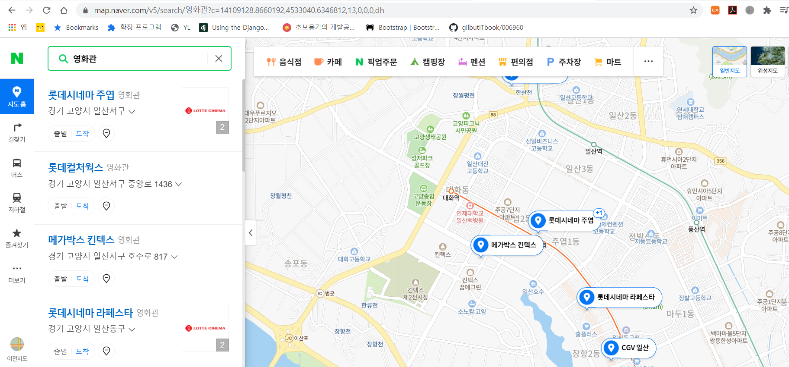

네이버 지도를 활용하여 현재위치에서 가장 가까운 영화관들이 나타나도록 하였습니다.

- 추천 영화

## 데이터베이스 모델링(ERD)

## UI / UX

- 페이지 컨셉에 맞추어 스크롤과 드래그 색상을 민트로 변경
- 메인 페이지에서 영화가 있는 포지션으로 auto smooth scroll 적용

- group button은 각 버튼 클릭 시 active 효과 적용

- 영화 포스터에 mouseover 하면 확대되면서 상세 정보가 뜨게 함
- 메인 페이지에서 우측하단 할인 이벤트 아이콘은 일반 회원 및 비로그인 상태에서 보이게 하여 과금 유도
- 좋아요 아이콘에 mouseover하면 하트가 움직이게 함
- 영화 리뷰 수정을 누를 경우, 자동으로 맨 밑으로 스크롤을 이동시키고 원래 작성되었던 리뷰를 hidden 처리하여 '수정'하고 있다는 느낌을 강화함
- 페이지 곳곳에 뒤로가기 버튼을 배치하여 
- 대부분의 구성을 col을 사용하여 모바일 최적화
- 카카오맵 이용시 주소 버튼이 아닌 input 박스에 값을 넣어도 동작하도록 편리성 추구
- 포스터가 없을 경우 대체 이미지(No image) 적용

## 느낀점

- 박예린
  - 

- 곽민준
  - 사실 비전공자로서 수업을 따라가기도 급급한데 갑자기 프로젝트를 만들라고 하니까 많이 당황스러웠다. 내역서대로 차근차근 구현하면 되는 것이 아니라, 하다못해 모델부터 내가 다 관계들을 짜야했으니까 말이다. 7월 중순부터 꽤 오랜 시간 동안 코딩을 공부한 것 같은데 아직도 멀었다는 생각이 많이 든다.
